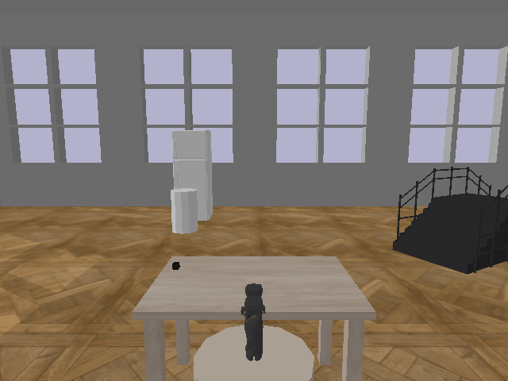
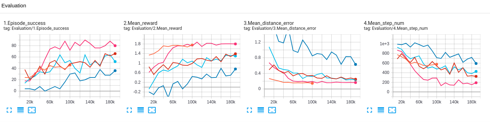

We introduce myGym, a toolkit suitable for fast prototyping of neural networks in the area of robotic manipulation and navigation. Our toolbox is fully modular, so you can train your network to control different robots in several envinronments defined parametrically. You can also create curicullum of tasks and test your network set of tasks with inreasing complexity. There is automatic evaluation and benchmark tool for your network. We pretrained the neural networks for visual recognition of all objects in the simulator. We constantly train networks to provide baselines for the tasks in the toolbox. The training is 50x faster with the visualization turned on than realtime simulations.

## Overview

| Environment  | Gym-v0 is suitable for manipulation, navigation and planning tasks|
|---|---|
| Workspaces | Table, Collaborative table, Maze, Vertical maze, Drawer, Darts, Football, Fridge, Stairs, Baskets |
| Vision  | Cartesians, RGB, Depth, Class, Centroid, Bounding Box, Semantic Mask, Latent vector |
| Robots  | 7 robotic arms, 2 dualarms, humanoid |
| Robot actions  | Absolute, Relative, Joints |
| Objects  | 54 objects in 5 categories |
| Tasks  | Reach, Push, Pick, Place, PicknPlace, Throw, Hit, Catch, Navigate|
| Randomizers  | Light, Texture, Size, Camera position |
| Baselines  | Tensorflow, Pytorch |

Learn more about the toolbox in [documentation](https://incognite.ciirc.cvut.cz/mygym/)

## Modular Structure

We developed fully modular toolbox where user can easily combine the predefined elements into custom envinronment. There are specific modules for each component of the simulation. User can easily modify and add custom modules. 

## Supported systems

Ubuntu 18.04, 20.04
Python 3.5, 3.6.,3.7,3.8
GPU acceleration strongly supported

## Installation

Clone the repository:

`git clone https://github.com/incognite/mygym.git`

`cd mygym`

We recommend to create conda environment:

`conda env create -f environment.yml`

`conda activate mygym`

Install mygym:

`python setup.py develop`

If you want to use pretrained visual modules, please download them first:

`cd myGym`
`sh download_vision.sh`

If you want to use pretrained baselines models, download them here:

`cd myGym`
`sh download_baselines.sh`

## Visualization

You can visualize the virtual gym prior to the training.

`python test.py`

There will be the default worskpace activated. The commands to the robot joints are random. 

There are also visual outputs from the active cameras (both RGB and Depth):

Find more details about this function in the [documentation](https://incognite.ciirc.cvut.cz/mygym/user_guide/visualization.html)

## Basic Training

Run the default training without specifying parameters:

`python train.py`

The training will start with gui window and standstill visualization. Wait until the first evaluation after 10000 steps to check the progress: 

After 50000 steps the arm starts to move towards the goal object:

After 100000 steps the arm is able to reach the goal object with 80% accuracy:

There are more training tutorials in the [documentation](https://incognite.ciirc.cvut.cz/mygym/user_guide/basic_training.html)

##  Parametric Training

As the myGym is modular toolbox you can easily train different robots:

`python train.py --robot jaco`

You can also change the workspace within the gym, task or a goal object. If you want to store ouput video just add record parameter:

`python train.py  --workspace collabtable --robot panda --task push --task_objects wrench --record 1`

You can fully control the environment, robot, object, task, reward, learning parameters and logging from the command line:

`python train.py --env_name Gym-v0  --workspace table --engine=pybullet --render=opengl --camera=8 --gui=1 --visualize=1 --robot=kuka --robot_action=joints --robot_init=[0.5, 0.5, 2.0] --task_type=reach --task_objects=[hammer] --used_objects=None --object_sampling_area=[-0.2, 0.7, 0.3, 0.9, 0.65, 0.65] --reward_type=gt --reward=distance --distance_type=euclidean --train=1 --train_framework=tensorflow --algo=ppo2 --max_episode_steps=1024 --algo_steps=1024 --steps=500000 --eval_freq=5000 --eval_episodes=100 --test_after_train=0 --logdir=trained_models --model_path=./trained_models/test/best_model.zip --record=0`

Learn more about simulation parameters in the [documentation](https://incognite.ciirc.cvut.cz/mygym/user_guide/tutorial_parametric.html)

## Config Training

As the parametric definition is problematic in more complex projects, we present config files that will help with the reproducibility of the results. The example of basic config file is [here(myGym/configs/train_example.conf)]. Yo can edit and clone this file according to your needs and run the training just by typing:

`python train.py --config ./configs/train_example.json`

## Parallel Training

We developed scripts for parallel training to speed up this process. You can edit the desired parameter in train_parallel.py and run it:

`python train_parallel.py`

The default config will train 4 parallel simulation with different RL in the same conditions. After several training steps you can see the difference in performace among algorhitms. For better performance the backround visualization is turned off:

## Pretrained models

You can use the test script for the visualization of pretrained models:

`python test.py --config ./trained_models/yourmodel/train.json`

It will load pretrained model and test it in the task and workspace defined in config file:

## Evaluation

There is automatic evaluation and logging in the train script. It is controlled by parameters --eval_freq and --eval_episodes. The log files are stored in the folder with trained model and you can easily visualize learning progress after the training and compare training parameters. There are also gifs for each eval period stored to compare robot performance during training. We also implemented evaluation in tensorboard:

`tensorboard --logdir ./trained_models/yourmodel`

If you want to interactively compare different parameters, just run the tensorboard without model dir specification:

## Environment

As myGym is focused on curicullum learning all the worspaces and tasks are concentrated in one gym, so you can easily transfer robot from one workspace to another, or from task to task without necessity to reload envinronment. The basic envinronment is called Gym-v0. There are more gyms for navigation and multiagent collaboration in preparation stage. 

## Robots

| Robot  |Type| Gripper  | DOF  | Parameter value |
|---|---|---|---|---|
| Kuka IIWA | arm  | magnetic  |  7 |  kuka |
|  Franka-Emica | arm  | two finger  | 6  |  panda |
| Jaco arm  | arm  |  two finger |  6 | jaco  |
| UR-3  | arm  | tactile gripper  |  6 | ur3  |
| UR-5  | arm  | tactile gripper  |  6 | ur5  |
| UR-10  | arm  | tactile gripper  |  6 | ur10  |
| Gummiarm  | arm  | passive palm  |  6 | gummi  |
| Reachy  | arm  | passive palm  |  8 | reachy  |
| Leachy  | arm  | passive palm  |  8 | leachy  |
| ReachyLeachy  | dualarm  | passive palms  |  16 | reachy_and_leachy |
| ABB Yumi  | dualarm  | two finger  |  24 | yummi  |
| Pepper  | humanoid | --  |  -- | --  |
| Thiago | humanoid  | --  |  -- | --  |
| Atlas  | humanoid  | --  |  -- | --  |

## Workspaces

| Name  |Type| Suitable tasks | Parameter value |
|---|---|---|---|
| Tabledesk | manipulation  | Reach, Push, Pick, Place, PicknPlace | table |
| Drawer | manipulation  | Reach, Pick, PicknPlace  | drawer |
| Fridge | manipulation  | Reach, Push, Open, Close, Pick | fridge |
| Baskets | manipulation  | Throw, Hit | baskets |
| Darts | manipulation  | Throw, Hit | darts |
| Football | manipulation  | Throw, Hit | football |
| Collaborative table | collaboration  | Give, Hold, Move together | collabtable |
| Vertical maze | planning  | -- | veticalmaze |
| Maze | navigation  | -- | maze |
| Stairs | navigation  | -- | stairs |

## Baselines

| Workspace  |Reach| Pick | Place | PicknPlace | Push | Throw | Hit | Open | Close | Kick | Give |
|---|---|---|---|---|---|---|---|---|---|---|---|
| Tabledesk | :heavy_check_mark: | :x: | :x: | :x: | :x: | :x: | :x: | :x: | :x: | :x: | :x: | :x: |
| Drawer | :heavy_check_mark: | :x: | :x: | :x: | :x: | :x: | :x: | :x: | :x: | :x: | :x: | :x: |
| Fridge | :heavy_check_mark: | :x: | :x: | :x: | :x: | :x: | :x: | :x: | :x: | :x: | :x: | :x: |
| Baskets | :heavy_check_mark: | :x: | :x: | :x: | :x: | :x: | :x: | :x: | :x: | :x: | :x: | :x: |
| Darts | :heavy_check_mark: | :x: | :x: | :x: | :x: | :x: | :x: | :x: | :x: | :x: | :x: | :x: |
| Football | :x: | :x: | :x: | :x: | :x: | :x: | :x: | :x: | :x: | :x: | :x: | :x: | 
| Collaborative table | :heavy_check_mark: | :x: | :x: | :x: | :x: | :x: | :x: | :x: | :x: | :x: | :x: | :x: |

## Leaderboard

In preparation

## Authors

[Incognite lab - CIIRC CTU](https://incognite.ciirc.cvut.cz) 

Core team:

[Michal Vavrecka](https://kognice.wixsite.com/vavrecka)

[Gabriela Sejnova](https://kognice.wixsite.com/vavrecka)

[Megi Mejdrechova](https://www.linkedin.com/in/megi-mejdrechova)

[Nikita Sokovnin](https://kognice.wixsite.com/vavrecka)

Contributors:

Radoslav Skoviera, Peter Basar, Vojtech Pospisil, Jiri Kulisek, Anastasia Ostapenko, Sara Thu Nguyen

## Paper

[myGym: Modular Toolkit for Visuomotor Robotic Tasks](https://arxiv.org/abs/2012.11643)
