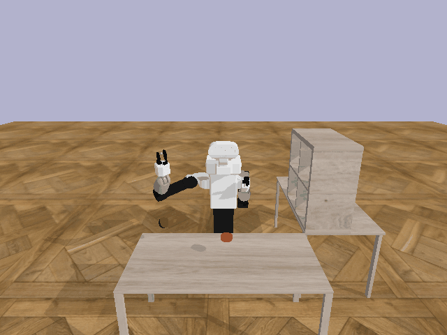
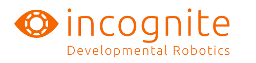

We introduce myGym, a toolkit suitable for fast prototyping of neural networks in the area of robotic manipulation and navigation. Our toolbox is fully modular, so that you can train your network with different robots, in several environments and on various tasks. You can also create a curriculum of tasks with increasing complexity and test your network on them. 

From version 3.10 there is SB3 and Gymnasium implemented and there is a basic set of protorewards to create any manipulation task from their combination. Their composition is semi automated and will be fully automated in next realese. It is possible to train multiple networks within one task and switch between them based on reward or adaptively. The number of networks is specified in config file.

## Install myGym 3.10

From myGym 3.10 there is Stable Baseline 3 and Gymnasium. 
If you want to use old myGym 3.7. with Stable Baselines1 and Gym, switch to branch mygym-3.7

Clone the repository:

`git clone https://github.com/incognite-lab/mygym.git`

`cd mygym`

Create Python 3.10 conda env:

`conda create -n  mygym Python=3.10`

`conda activate mygym`

Install myGym:

`pip install -e .`

If you face troubles with mpi4py dependency install the lib:

`sudo apt install libopenmpi-dev`

## myGym 3.10 presents

* Atomic rewards 

* Protorewards

* Atomic actions

* Easy multi-step task definition

* Nico and Tiago robot support

* Multi-step tasks with custom robots

* Multi-goal rewards for training long horizon

* Automatic tasks checker (oraculum) 

* Parallelized training within CPU and GPU on cluster

## Overview

| Environment  | Gym-v0 is suitable both single-step and multi-step manipulation and navigation|
|---|---|
| Workspaces | Table, Collaborative table, Maze, Vertical maze, Drawer, Darts, Football, Fridge, Stairs, Baskets |
| Vision  | Cartesians, RGB, Depth, Class, Centroid, Bounding Box, Semantic Mask, Latent Vector |
| Robots  | 9 robotic arms, 2 dualarms, humanoid |
| Robot actions  | Absolute, Relative, Joints |
| Objects  | 54 objects in 5 categories |
| Tasks  | Reach, Press, Switch, Turn, Push, Pick, Place, PicknPlace, Poke,MultiReach, MultiPNP|
| Randomizers  | Light, Texture, Size, Camera position |
| Baselines  | Tensorflow, Pytorch |
| Physics  | Bullet, Mujoco deprecated from version 2.0 |

## Test the environments prior training

You can visualize the virtual gym env prior to the training. 

`python test.py`

There will be the default workspace activated.  

## Training

Run the default training without specifying the parameters:

`python train.py`

The default traning is without GUI. You can turn GUI on, or parallelize traning (see train parameters)

## Environment

As myGym allows curriculum learning, the workspaces and tasks are concentrated in single gym, so that you can easily transfer the robot. The basic environment is called Gym-v0. There are more gyms for navigation and multi-agent collaboration in preparation. 

## Robots

| Robot  |Type| Gripper  | DOF  | Parameter value |
|---|---|---|---|---|
| UR-3  | arm  | no gripper  |  6 | ur3  |
| UR-5  | arm  | no gripper  |  6 | ur5  |
| UR-10  | arm  | no gripper  |  6 | ur10  |
| Kuka IIWA | arm  | magnetic, gripper  |  6 |  kuka |
| Reachy  | arm  | passive palm  |  7 | reachy  |
| Leachy  | arm  | passive palm  |  7 | leachy  |
|  Franka-Emica | arm  | gripper  | 7  |  panda |
| Jaco arm  | arm  |  two finger |  13 | jaco  |
| Gummiarm  | arm  | passive palm  |  13 | gummi  |
| Human Support Robot (HSR) | arm | gripper | 7 | hsr |
| ABB Yumi  | dualarm  | two finger  |  12 | yumi  |
| ReachyLeachy  | dualarm  | passive palms  |  14 | reachy_and_leachy |
| Pepper  | humanoid | --  |  20 | pepper  |
| Tiago | humanoid  | --  |  19 | tiago  |
| Nico  | humanoid  | --  |  14 | nico  |

## Workspaces

| Name  |Type| Suitable tasks | Parameter value |
|---|---|---|---|
| Tabledesk | manipulation  | Reach,Press, Switch, Turn, PicknPlace | table |
| Drawer | manipulation  | Pick, Place, PicknPlace  | drawer |
| Fridge | manipulation  | Push, Pick | fridge |
| Baskets | manipulation  | Throw, Hit | baskets |
| Darts | manipulation  | Throw, Hit | darts |
| Football | manipulation  | Throw, Hit | football |
| Collaborative table | collaboration  | Give, Hold, Move together | collabtable |
| Vertical maze | planning  | -- | veticalmaze |
| Maze | navigation  | -- | maze |
| Stairs | navigation  | -- | stairs |

## Authors

[Incognite lab - CIIRC CTU](https://incognite-lab.github.io) 

Core team:

[Michal Vavrecka](https://kognice.wixsite.com/vavrecka)

[Gabriela Sejnova](https://www.linkedin.com/in/gabriela-sejnova/)

[Megi Mejdrechova](https://www.linkedin.com/in/megi-mejdrechova)

[Nikita Sokovnin](https://www.linkedin.com/in/nikita-sokovnin-250939198/)

[Frederik Albl](https://incognite-lab.github.io)

[Sofia Ostapenko](https://incognite-lab.github.io)

[Radoslav Skoviera](https://incognite-lab.github.io)

Contributors:

Peter Basar, Michael Tesar, Vojtech Pospisil, Jiri Kulisek, Anastasia Ostapenko, Sara Thu Nguyen

## Citation

'@INPROCEEDINGS{9643210,
  author={Vavrecka, Michal and Sokovnin, Nikita and Mejdrechova, Megi and Sejnova, Gabriela},
  
  
  booktitle={2021 IEEE 33rd International Conference on Tools with Artificial Intelligence (ICTAI)}, 
  
  
  title={MyGym: Modular Toolkit for Visuomotor Robotic Tasks}, 
  
  
  year={2021},
  volume={},
  number={},
  pages={279-283},
  
  
  doi={10.1109/ICTAI52525.2021.00046}}'

## Paper

[myGym: Modular Toolkit for Visuomotor Robotic Tasks](https://arxiv.org/abs/2012.11643)
