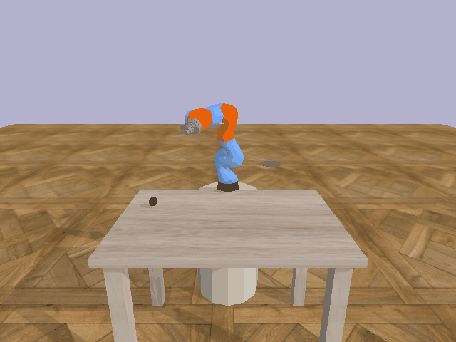
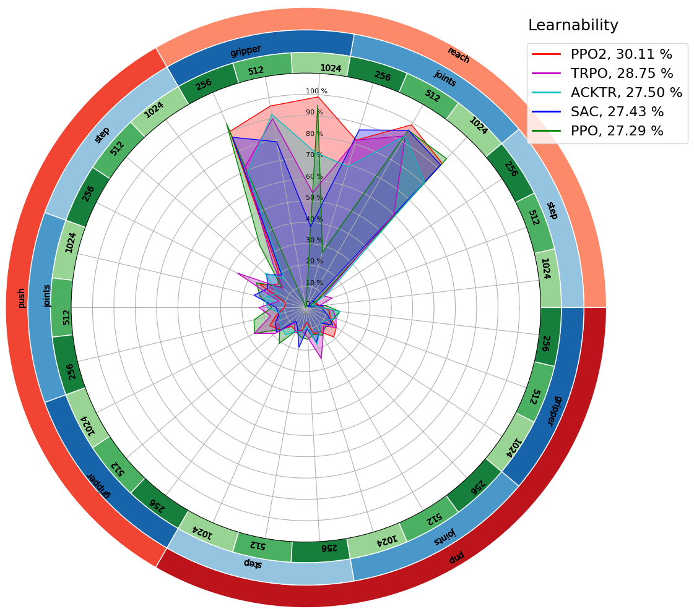

We introduce myGym, a toolkit suitable for fast prototyping of neural networks in the area of robotic manipulation and navigation. Our toolbox is fully modular, so that you can train your network with different robots, in several environments and on various tasks. You can also create a curriculum of tasks  with increasing complexity and test your network on them. We also included an automatic evaluation and benchmark tool for your developed model. We have pretained the Yolact network for visual recognition of all objects in the simulator, so that you can reward your networks based on visual sensors only. We keep training the current state-of-the-art algorithms to provide baselines for the tasks in the toolbox. There is also a leaderboard showing algorithms with the best generalization capability, tested on the tasks in our basic curriculum. From version 2.0 it is possible to train multiple networks within one task and switch between them based on reward or adaptively. The number of neteworks is specified in config file.

## Advantages

* Separate modules for fast prototyping (task.py, reward.py, env.py)

* Pretrained vision module for instance wise semantic segmentation

* Compositional environments

## Overview

| Environment  | Gym-v0 is suitable for manipulation, navigation and planning tasks|
|---|---|
| Workspaces | Table, Collaborative table, Maze, Vertical maze, Drawer, Darts, Football, Fridge, Stairs, Baskets |
| Vision  | Cartesians, RGB, Depth, Class, Centroid, Bounding Box, Semantic Mask, Latent Vector |
| Robots  | 8 robotic arms, 2 dualarms, humanoid |
| Robot actions  | Absolute, Relative, Joints |
| Objects  | 54 objects in 5 categories |
| Tasks  | Reach, Press, Switch, Turn, Push, Pick, Place, PicknPlace, Poke,|
| Randomizers  | Light, Texture, Size, Camera position |
| Baselines  | Tensorflow, Pytorch |

Learn more about the toolbox in our [documentation](https://mygym.readthedocs.io/en/latest/)

## Leaderboard

Learnability is represented as a single value metric that evaluates algorithms under various conditions, allowing us to compare different RL algorithms. The number of conditions is limited for practical reasons, as the number of training configurations grows exponentially with each new condition, and each configuration requires standalone training and evaluation. Therefore, we limited the total number of combinations to $3^3$ = 27, which can be evaluated in few hours with a standard computer infrastructure.

| Pos. | Algorhitm | Score |
|---|---|---|
|1.| PPO2 | 30.11  |
|2.| TRPO | 28.75  |
|3.| ACKTR | 27.5  |
|4.| SAC | 27.43 |
|5.| PPO | 27.21 |
|5.| myAlgo | 15.00  |

## Modular Structure

We have developed a fully modular toolbox where the user can easily combine the predefined elements into a custom environment. There are specific modules for each component of the simulation, as depicted in the following scheme. 

## Supported systems

Ubuntu 18.04, 20.04

Python 3

GPU acceleration strongly recommended

## Installation

Clone the repository:

`git clone https://github.com/incognite-lab/mygym.git`

`cd mygym`

We recommend to create a conda environment:

`conda env create -f environment.yml`

`conda activate mygym`

Install myGym:

`python setup.py develop`

If you want to use the pretrained visual modules, please download them first:

`cd myGym`
`sh download_vision.sh`

If you want to use the pretrained baseline models, download them here:

`cd myGym`
`sh download_baselines.sh`

## Visualization

You can visualize the virtual gym env prior to the training.

`python test.py`

There will be the default workspace activated. The commands to the robot joints are random. 

There are also visual outputs from the active cameras (both RGB and Depth):

Find more details about this function in the [documentation](https://mygym.readthedocs.io/en/latest/user_guide/visualization.html)

## Basic Training

Run the default training without specifying the parameters:

`python train.py`

The training will start with the GUI window and a standstill visualization. Wait until the first evaluation to check the progress: 

There are more training tutorials in the [documentation](https://mygym.readthedocs.io/en/latest/user_guide/basic_training.html)

## Tasks

### Reach

``python train.py --config ./configs/train_reach.json``

### Press

``python train.py --config ./configs/train_press.json``

For details see [documentation](https://mygym.readthedocs.io/en/latest/user_guide/train_press.html)

### Switch

``python train.py --config ./configs/train_switch.json``

For details see [documentation](https://mygym.readthedocs.io/en/latest/user_guide/train_switch.html)

### Turn

``python train.py --config ./configs/train_turn.json``

For details see [documentation(https://mygym.readthedocs.io/en/latest/user_guide/train_turn.html)

### Push

``python train.py --config ./configs/train_push.json``

### Poke

``python train.py --config ./configs/train_poke.json``

### Pick and Place

``python train.py --config ./configs/train_pnp.json``

### Multi-step tasks

Fropm myGym 2.0 you can define multi-step tasks easily in config file and adopt multiple networks and swich among them within taks (Documentationm in preparation)

##  Parametric Training

As myGym is modular, you can easily train with different robots:

`python train.py --robot jaco`

You can also change the workspace within the gym, the task or the goal object. If you want to store an ouput video, just add the record parameter:

`python train.py  --workspace collabtable --robot panda --task push --task_objects wrench --record 1`

You can fully control the environment, robot, object, task, reward, learning parameters and logging from the command line:

`python train.py --env_name Gym-v0  --workspace table --engine=pybullet --render=opengl --camera=8 --gui=1 --visualize=1 --robot=kuka --robot_action=joints --robot_init=[0.5, 0.5, 2.0] --task_type=reach --task_objects=[hammer] --used_objects=None --object_sampling_area=[-0.2, 0.7, 0.3, 0.9, 0.65, 0.65] --reward_type=gt --reward=distance --distance_type=euclidean --train=1 --train_framework=tensorflow --algo=ppo2 --max_episode_steps=1024 --algo_steps=1024 --steps=500000 --eval_freq=5000 --eval_episodes=100 --test_after_train=0 --logdir=trained_models --model_path=./trained_models/test/best_model.zip --record=0`

Learn more about the simulation parameters in the [documentation](https://mygym.readthedocs.io/en/latest/user_guide/tutorial_parametric.html)

## Config Training

As the parametric definition is problematic in more complex projects, we present config files that will help with the reproducibility of results. The example of basic config file is [here(myGym/configs/train_example.conf)]. You can edit and clone this file according to your needs and run the training just by typing:

`python train.py --config ./configs/train_example.json`

## Parallel Training

We have developed scripts for parallel training to speed up this process. You can edit the desired parameter in train_parallel.py and run it:

`python train_parallel.py`

The default config will train 4 parallel simulations with different RL algorithms under the same conditions. After several training steps, you can see the difference in performace among algorithms. For better performance, the background visualization is turned off:

## Pretrained models

You can use the test script for the visualization of pretrained models:

`python test.py --config ./trained_models/yourmodel/train.json`

It will load the pretrained model and test it in the task and workspace defined in the config file.

## Evaluation

There is automatic evaluation and logging included in the train script. It is controlled by parameters --eval_freq and --eval_episodes. The log files are stored in the folder with the trained model and you can easily visualize the learning progress after the training. There are also gifs for each eval period stored to compare the robot performance during training. We have also implemented evaluation in tensorboard:

`tensorboard --logdir ./trained_models/yourmodel`

If you want to interactively compare different parameters, just run tensorboard without model dir specification:

There are also other visualization scripts (Documerntation in preparation)

## Environment

As myGym allows curriculum learning, the workspaces and tasks are concentrated in single gym, so that you can easily transfer the robot. The basic environment is called Gym-v0. There are more gyms for navigation and multi-agent collaboration in preparation. 

## Robots

| Robot  |Type| Gripper  | DOF  | Parameter value |
|---|---|---|---|---|
| UR-3  | arm  | no gripper  |  6 | ur3  |
| UR-5  | arm  | no gripper  |  6 | ur5  |
| UR-10  | arm  | no gripper  |  6 | ur10  |
| Kuka IIWA | arm  | magnetic  |  6 |  kuka |
| Reachy  | arm  | passive palm  |  7 | reachy  |
| Leachy  | arm  | passive palm  |  7 | leachy  |
|  Franka-Emica | arm  | gripper  | 7  |  panda |
| Jaco arm  | arm  |  two finger |  13 | jaco  |
| Gummiarm  | arm  | passive palm  |  13 | gummi  |
| ABB Yumi  | dualarm  | two finger  |  12 | yummi  |
| ReachyLeachy  | dualarm  | passive palms  |  14 | reachy_and_leachy |
| Pepper  | humanoid | --  |  20 | WIP  |
| Thiago | humanoid  | --  |  19 | WIP  |
| Atlas  | humanoid  | --  |  28 | WIP  |

## Workspaces

| Name  |Type| Suitable tasks | Parameter value |
|---|---|---|---|
| Tabledesk | manipulation  | Reach,Press, Switch, Turn, PicknPlace | table |
| Drawer | manipulation  | Pick, Place, PicknPlace  | drawer |
| Fridge | manipulation  | Push, Open, Close, Pick | fridge |
| Baskets | manipulation  | Throw, Hit | baskets |
| Darts | manipulation  | Throw, Hit | darts |
| Football | manipulation  | Throw, Hit | football |
| Collaborative table | collaboration  | Give, Hold, Move together | collabtable |
| Vertical maze | planning  | -- | veticalmaze |
| Maze | navigation  | -- | maze |
| Stairs | navigation  | -- | stairs |

## Baselines

| Workspace  |Reach| Pick | Place | PicknPlace | Push | Press | Switch | Turn | Poke | Multistep PNP | Multistep Reach |
|---|---|---|---|---|---|---|---|---|---|---|---|
| Tabledesk | :heavy_check_mark: | :heavy_check_mark: | :heavy_check_mark: | :heavy_check_mark: | :heavy_check_mark: | :heavy_check_mark: | :heavy_check_mark: | :heavy_check_mark: | :heavy_check_mark: | :heavy_check_mark: | :heavy_check_mark: | :heavy_check_mark: |
| Drawer | :heavy_check_mark: | :heavy_check_mark: | :heavy_check_mark: | :heavy_check_mark: | :heavy_check_mark: | :heavy_check_mark: | :heavy_check_mark: | :heavy_check_mark: | :heavy_check_mark: | :heavy_check_mark: | :heavy_check_mark: | :heavy_check_mark: |
| Collaborative table | :heavy_check_mark: | :heavy_check_mark: | :heavy_check_mark: | :heavy_check_mark: | :heavy_check_mark: | :heavy_check_mark: | :heavy_check_mark: | :heavy_check_mark: | :heavy_check_mark: | :heavy_check_mark: | :heavy_check_mark: | :heavy_check_mark: |

## Learnability 

The new global evaluation metric, which we call \textit{learnability}, allows the user to evaluate and compare algorithms in a more systematic fashion. Learnability is defined as a general ability to learn irrespective of environmental conditions. The goal is to test an algorithm with respect to the complexity of environment. We have decomposed the environment complexity into independent scales. The first scale is dedicated to the complexity of the task. Second scale exploits the complexity of the robotic body that is controlled by the neural network. The third scale stands for the temporal complexity of the environment. 

## Authors

[Incognite lab - CIIRC CTU](https://incognite-lab.github.io) 

Core team:

[Michal Vavrecka](https://kognice.wixsite.com/vavrecka)

[Gabriela Sejnova](https://www.linkedin.com/in/gabriela-sejnova/)

[Megi Mejdrechova](https://www.linkedin.com/in/megi-mejdrechova)

[Nikita Sokovnin](https://www.linkedin.com/in/nikita-sokovnin-250939198/)

Contributors:

Radoslav Skoviera, Peter Basar, Michael Tesar, Vojtech Pospisil, Jiri Kulisek, Anastasia Ostapenko, Sara Thu Nguyen

## Citation

'@INPROCEEDINGS{9643210,
  author={Vavrecka, Michal and Sokovnin, Nikita and Mejdrechova, Megi and Sejnova, Gabriela},
  
  
  booktitle={2021 IEEE 33rd International Conference on Tools with Artificial Intelligence (ICTAI)}, 
  
  
  title={MyGym: Modular Toolkit for Visuomotor Robotic Tasks}, 
  
  
  year={2021},
  volume={},
  number={},
  pages={279-283},
  
  
  doi={10.1109/ICTAI52525.2021.00046}}'

## Paper

[myGym: Modular Toolkit for Visuomotor Robotic Tasks](https://arxiv.org/abs/2012.11643)
