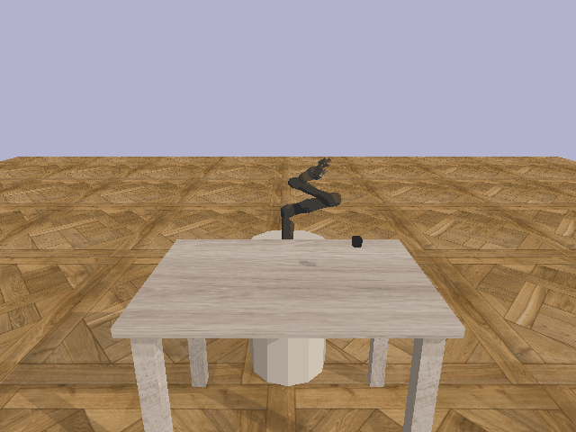
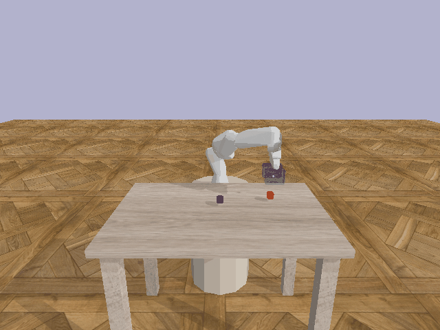
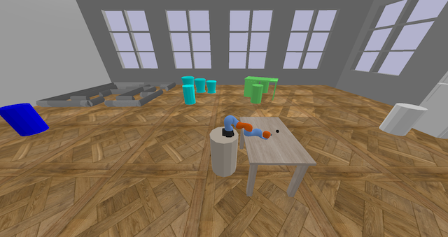
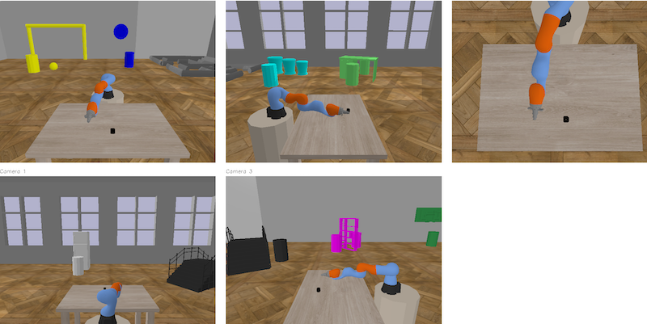

We introduce myGym, a toolkit suitable for fast prototyping of neural networks in the area of robotic manipulation and navigation. Our toolbox is fully modular, so that you can train your network with different robots, in several environments and on various tasks. You can also create a curriculum of tasks  with increasing complexity and test your network on them. We also included an automatic evaluation and benchmark tool for your developed model. We have pretained the Yolact network for visual recognition of all objects in the simulator, so that you can reward your networks based on visual sensors only. 

We keep training the current state-of-the-art algorithms to provide baselines for the tasks in the toolbox. There is also a leaderboard showing algorithms with the best generalization capability, tested on the tasks in our basic curriculum. From version 2.0 it is possible to train multiple networks within one task and switch between them based on reward or adaptively. The number of neteworks is specified in config file.

## Install myGym 3.10

From myGym 3.10 there is Stable Baseline 3 and Gymnasium. 
If you want to use old myGym 3.7. with Stable Baselines1 and Gym, switch to branch mygym-3.7

Clone the repository:

`git clone https://github.com/incognite-lab/mygym.git`

`cd mygym`

Create Python 3.7 conda env (later Python versions does not support TF 0.15.5 neccesary for Stable baselines ):

`conda create -n  mygym Python=3.10`

`conda activate mygym`

Install myGym:

`pip install -e .`

If you face troubles with mpi4py dependency install the lib:

`sudo apt install libopenmpi-dev`

## myGym 3.10 news

* Atomic rewards 

* Easy multi-step task definition

* Nico and Tiago robot support

* Multi-step tasks defined inside [config file](myGym/configs/train_pnp_2n_multitask4.json#L20)  with customizable [observations](myGym/configs/train_pnp_2n_multitask4.json#L30) 

* Multi-goal rewards for training long horizon [tasks](myGym/envs/rewards.py#L1365)

* REAL robotic gripping based on [friction](myGym/envs/robots/franka_emika/panda/urdf/panda1.urdf) or [containment](myGym/envs/robots/franka_emika/panda/urdf/panda_cgripper.urdf)

* Multi-network training - three networks switching in Pick and rotate task

## Overview

| Environment  | Gym-v0 is suitable both single-step and multi-step manipulation and navigation|
|---|---|
| Workspaces | Table, Collaborative table, Maze, Vertical maze, Drawer, Darts, Football, Fridge, Stairs, Baskets |
| Vision  | Cartesians, RGB, Depth, Class, Centroid, Bounding Box, Semantic Mask, Latent Vector |
| Robots  | 9 robotic arms, 2 dualarms, humanoid |
| Robot actions  | Absolute, Relative, Joints |
| Objects  | 54 objects in 5 categories |
| Tasks  | Reach, Press, Switch, Turn, Push, Pick, Place, PicknPlace, Poke,MultiReach, MultiPNP|
| Randomizers  | Light, Texture, Size, Camera position |
| Baselines  | Tensorflow, Pytorch |
| Physics  | Bullet, Mujoco deprecated from version 2.0 |

## Test the environments prior training

You can visualize the virtual gym env prior to the training. 

`python test.py`

There will be the default workspace activated.  

EXPERIMENTAL - You can control the robot and gripper from keyboard (arrows and A and Z for third axis in caartesian), spawn object to test the task (WIP)

There are also visual outputs from the active cameras (both RGB and Depth):

Find more details about this function in the [documentation](https://mygym.readthedocs.io/en/latest/user_guide/visualization.html)

## Training

Run the default training without specifying the parameters:

`python train.py`

The training will start with the GUI window and a standstill visualization. Wait until the first evaluation to check the progress: 

There are more training tutorials in the [documentation](https://mygym.readthedocs.io/en/latest/user_guide/basic_training.html)

## Environment

As myGym allows curriculum learning, the workspaces and tasks are concentrated in single gym, so that you can easily transfer the robot. The basic environment is called Gym-v0. There are more gyms for navigation and multi-agent collaboration in preparation. 

## Robots

| Robot  |Type| Gripper  | DOF  | Parameter value |
|---|---|---|---|---|
| UR-3  | arm  | no gripper  |  6 | ur3  |
| UR-5  | arm  | no gripper  |  6 | ur5  |
| UR-10  | arm  | no gripper  |  6 | ur10  |
| Kuka IIWA | arm  | magnetic, gripper  |  6 |  kuka |
| Reachy  | arm  | passive palm  |  7 | reachy  |
| Leachy  | arm  | passive palm  |  7 | leachy  |
|  Franka-Emica | arm  | gripper  | 7  |  panda |
| Jaco arm  | arm  |  two finger |  13 | jaco  |
| Gummiarm  | arm  | passive palm  |  13 | gummi  |
| Human Support Robot (HSR) | arm | gripper | 7 | hsr |
| ABB Yumi  | dualarm  | two finger  |  12 | yumi  |
| ReachyLeachy  | dualarm  | passive palms  |  14 | reachy_and_leachy |
| Pepper  | humanoid | --  |  20 | WIP  |
| Thiago | humanoid  | --  |  19 | WIP  |
| Atlas  | humanoid  | --  |  28 | WIP  |

## Workspaces

| Name  |Type| Suitable tasks | Parameter value |
|---|---|---|---|
| Tabledesk | manipulation  | Reach,Press, Switch, Turn, PicknPlace | table |
| Drawer | manipulation  | Pick, Place, PicknPlace  | drawer |
| Fridge | manipulation  | Push, Pick | fridge |
| Baskets | manipulation  | Throw, Hit | baskets |
| Darts | manipulation  | Throw, Hit | darts |
| Football | manipulation  | Throw, Hit | football |
| Collaborative table | collaboration  | Give, Hold, Move together | collabtable |
| Vertical maze | planning  | -- | veticalmaze |
| Maze | navigation  | -- | maze |
| Stairs | navigation  | -- | stairs |

## Authors

[Incognite lab - CIIRC CTU](https://incognite-lab.github.io) 

Core team:

[Michal Vavrecka](https://kognice.wixsite.com/vavrecka)

[Gabriela Sejnova](https://www.linkedin.com/in/gabriela-sejnova/)

[Megi Mejdrechova](https://www.linkedin.com/in/megi-mejdrechova)

[Nikita Sokovnin](https://www.linkedin.com/in/nikita-sokovnin-250939198/)

Contributors:

Radoslav Skoviera, Peter Basar, Michael Tesar, Vojtech Pospisil, Jiri Kulisek, Anastasia Ostapenko, Sara Thu Nguyen

## Citation

'@INPROCEEDINGS{9643210,
  author={Vavrecka, Michal and Sokovnin, Nikita and Mejdrechova, Megi and Sejnova, Gabriela},
  
  
  booktitle={2021 IEEE 33rd International Conference on Tools with Artificial Intelligence (ICTAI)}, 
  
  
  title={MyGym: Modular Toolkit for Visuomotor Robotic Tasks}, 
  
  
  year={2021},
  volume={},
  number={},
  pages={279-283},
  
  
  doi={10.1109/ICTAI52525.2021.00046}}'

## Paper

[myGym: Modular Toolkit for Visuomotor Robotic Tasks](https://arxiv.org/abs/2012.11643)
