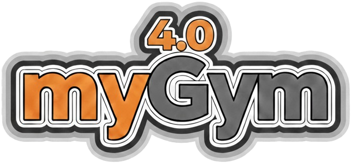

[](https://shields.io/)
[](https://shields.io/)
[](https://shields.io/)
[](https://shields.io/)
[](https://shields.io/)
[](https://shields.io/)
[](https://shields.io/)
[](https://shields.io/)




We introduce myGym, a toolkit suitable for fast prototyping of neural networks in the area of robotic manipulation and navigation. 

From version 4.0 you can easily create new training task without coding. You will just specify target objects in config, create long horizon task as sequence of atomic actions vocabulary (approach,withdraw,grasp,drop,move,rotate,follow,trasform) and select robot. Your task will be automatically build with the rewards paired for each stag.  It is possible to train multiple networks (multippo) within one task.

There are also novel functions to automatize workflow. Load new objects and robots, check their physical functionality (test_robot, test_robot_ik), configure task and test its  feasibility via taskchecker, and let it train on CPU,GPU you specify. After training visualize and benchmark via show command. 

We provide pretrained baselines for G1,Tiago, Nico and Pepper humanoids and also Kuka, Panda, UR and other robotic arms.

The next release will include [PRAG](https://arxiv.org/abs/2507.09167)  - procedural action generator 


## Install myGym 4.0

From myGym 3.10 there is Stable Baseline 3 and Gymnasium. 
If you want to use old myGym 3.7. with Stable Baselines1 and Gym, switch to branch mygym-3.7


Clone the repository:

`git clone https://github.com/incognite-lab/mygym.git`

`cd mygym`

Create Python 3.10 conda env:

`conda create -n mygym Python=3.10`

`conda activate mygym`

Install myGym:

`pip install -e .`

If you face troubles with mpi4py dependency install the lib:

`sudo apt install libopenmpi-dev`


## How to train new robot and tasks

### visualize_robot

It allows you to load and manipulate robot models in a 3D environment with joint sliders to control each joint independently.

```bash
python myGym/visualize_robot.py
```

### visualize_robot_ik

It allows you to test IK solutions by specifying target positions and orientations.

```bash
python myGym/visualize_robot_ik.py
```

### taskchecker


```bash
python myGym/taskchecker.py
```


### train

Train selected robot with preselcted task.

```bash
# Default training
python myGym/train.py

# Train with specific config
python myGym/train.py --config ./configs/train_A.json

# Train with GUI enabled
python myGym/train.py --config ./configs/train_A.json -g 1

# Train with multiprocessing
python myGym/train.py --config ./configs/train_A.json -i 4

# Train for specific number of steps
python myGym/train.py --config ./configs/train_A.json -s 100000
```

### show

The `interactive launcher for viewing training results and testing trained models.

```bash

python myGym/show.py

```


## Unit Tests


#### test_robots.py
Tests robot URDF joint limit reachability for all robots in the robot dictionary.

```bash
python3 myGym/unittest/test_robots.py

```

#### test_robot_reachability.py
Tests robot IK reachability across a 3D volume. Generates a 3D plot of reachable points and bounding box.

```bash
python3 myGym/unittest/test_robot_reachability.py
```

#### test_train_configs.py
Tests train.py with all configuration files in the `./configs` folder. Reports which configs train successfully.

```bash
python3 myGym/unittest/test_train_configs.py

```

#### test_oraculum_configs.py
Tests the oraculum (automatic solver) with all configuration files. Verifies task feasibility.

```bash
python3 myGym/unittest/test_oraculum_configs.py
```

For more details, see `myGym/unittest/README.md`.

## Robots

| Robot  |Type| Gripper  | DOF  | Parameter value |
|---|---|---|---|---|
| UR-3  | arm  | no gripper  |  6 | ur3  |
| UR-5  | arm  | no gripper  |  6 | ur5  |
| UR-10  | arm  | no gripper  |  6 | ur10  |
| Kuka IIWA | arm  | magnetic, gripper  |  6 |  kuka |
| Reachy  | arm  | passive palm  |  7 | reachy  |
| Leachy  | arm  | passive palm  |  7 | leachy  |
|  Franka-Emica | arm  | gripper  | 7  |  panda |
| Jaco arm  | arm  |  two finger |  13 | jaco  |
| Gummiarm  | arm  | passive palm  |  13 | gummi  |
| Human Support Robot (HSR) | arm | gripper | 7 | hsr |
| ABB Yumi  | dualarm  | two finger  |  12 | yumi  |
| ReachyLeachy  | dualarm  | passive palms  |  14 | reachy_and_leachy |
| Pepper  | humanoid | 5 fingers  |  20 | pepper  |
| Tiago | humanoid  | 2 fingers  |  19 | tiago  |
| Nico  | humanoid  | 4 fingers  |  14 | nico  |
| G1  | humanoid  | 3 fingers  |  42 | g1  |

## Authors


[Incognite lab - CIIRC CTU](https://incognite-lab.github.io) 

Core team:

[Michal Vavrecka](https://kognice.wixsite.com/vavrecka)

[Gabriela Sejnova](https://www.linkedin.com/in/gabriela-sejnova/)

[Megi Mejdrechova](https://www.linkedin.com/in/megi-mejdrechova)

[Nikita Sokovnin](https://www.linkedin.com/in/nikita-sokovnin-250939198/)

[Frederik Albl](https://incognite-lab.github.io)

[Sofia Ostapenko](https://incognite-lab.github.io)

[Radoslav Skoviera](https://incognite-lab.github.io)

Contributors:

Peter Basar, Michael Tesar, Vojtech Pospisil, Jiri Kulisek, Anastasia Ostapenko, Sara Thu Nguyen

## Citation

'@INPROCEEDINGS{9643210,
  author={Vavrecka, Michal and Sokovnin, Nikita and Mejdrechova, Megi and Sejnova, Gabriela},
  
  
  booktitle={2021 IEEE 33rd International Conference on Tools with Artificial Intelligence (ICTAI)}, 
  
  
  title={MyGym: Modular Toolkit for Visuomotor Robotic Tasks}, 
  
  
  year={2021},
  volume={},
  number={},
  pages={279-283},
  
  
  doi={10.1109/ICTAI52525.2021.00046}}'

## Paper

[myGym: Modular Toolkit for Visuomotor Robotic Tasks](https://arxiv.org/abs/2012.11643)
