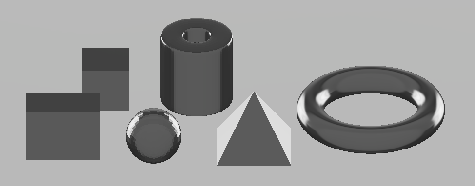
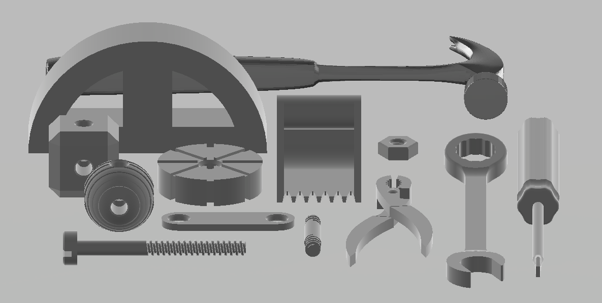
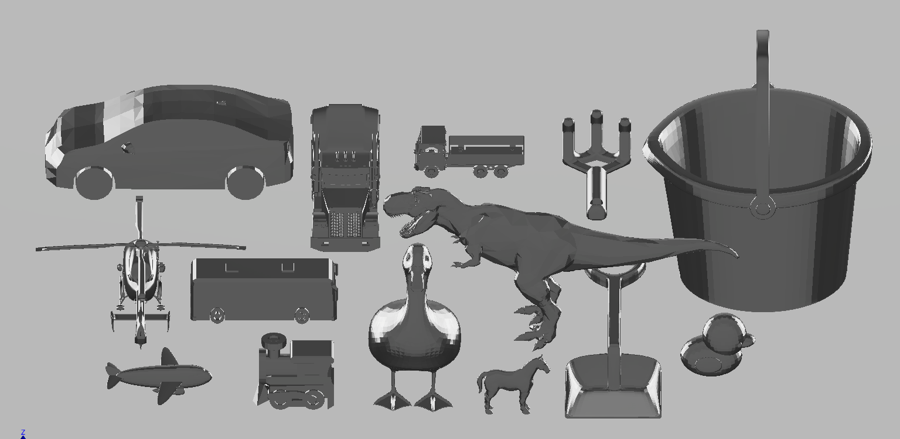
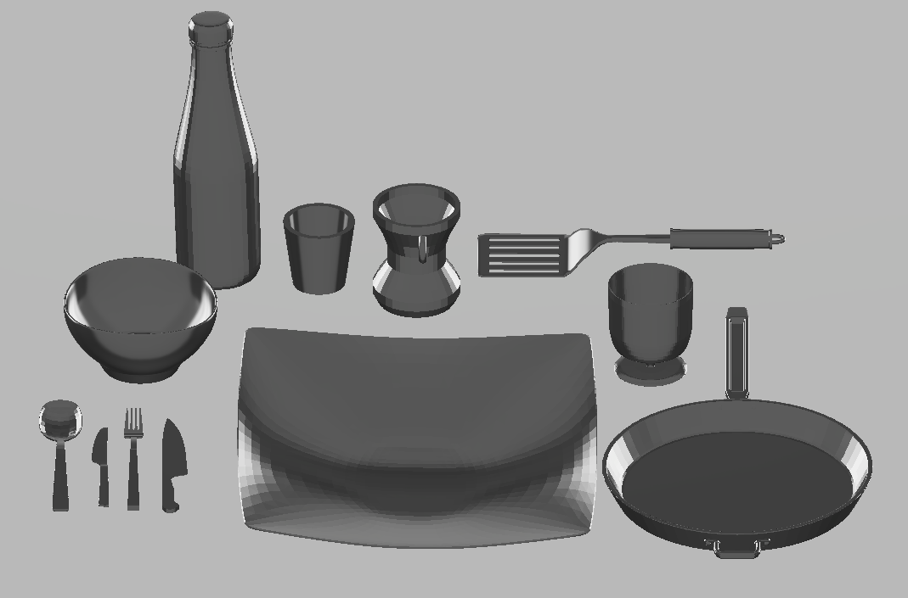
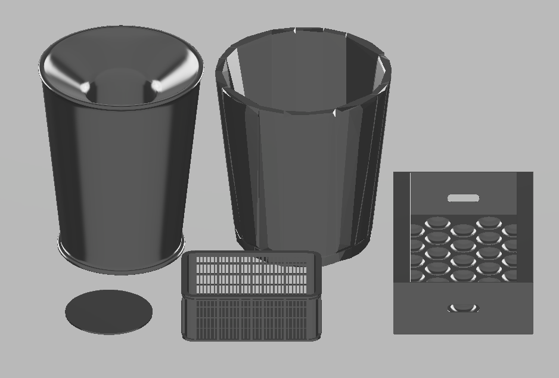

.. _mygym_objects:

Objects
=======

The toolkit allows you to add various objects to your training environment. Here are presented the implemented objects sorted into categories. You can also add custom object by placing its model and URDF file into envs/objects directory. For details about how myGym works with objects in the simulation, see :ref:`env_object`.

Geometric
---------
* cube, cylinder, prism, sphere, pyramid, torus

Assembly
--------
* car_roof, cube_holes, ex_bucket, hammer, nut, peg_screw, pliers, screw_round, screwdriver, sphere_holes, wafer, wheel, wrench

Toys
----
* bird, bucket, bus, car, dog, duck, helicopter, horse, lorry, plane, rake, shovel, tractor, train, trex, truck

Household
---------
* bottle, bowl, fork, glass, jug, knife, mug, pan, plate, sharp_knife, spatula, spoon

Storage
-------
* bin, box, crate, target, trash 

Furniture
---------
* armchair, bookcase, chair, cupboard, sofa, table

 .. image:: furniture_pic_b.png
  :width: 700
  :alt: Furniture objects