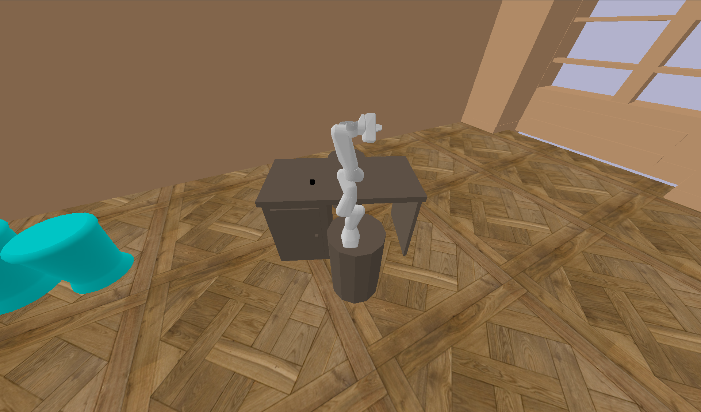
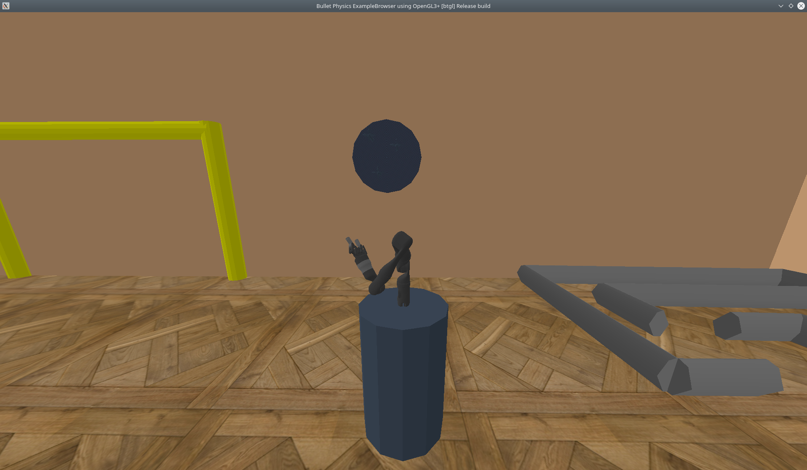
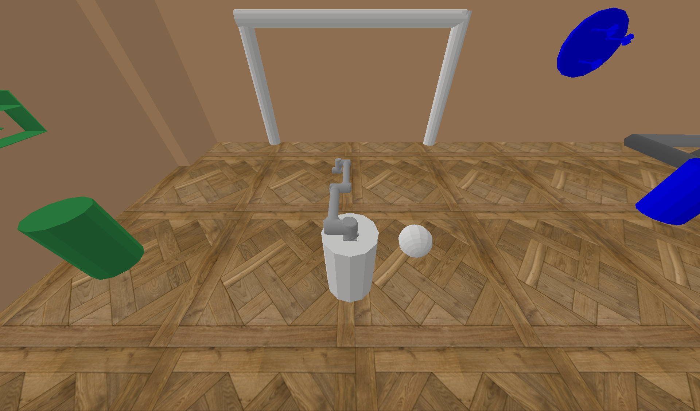
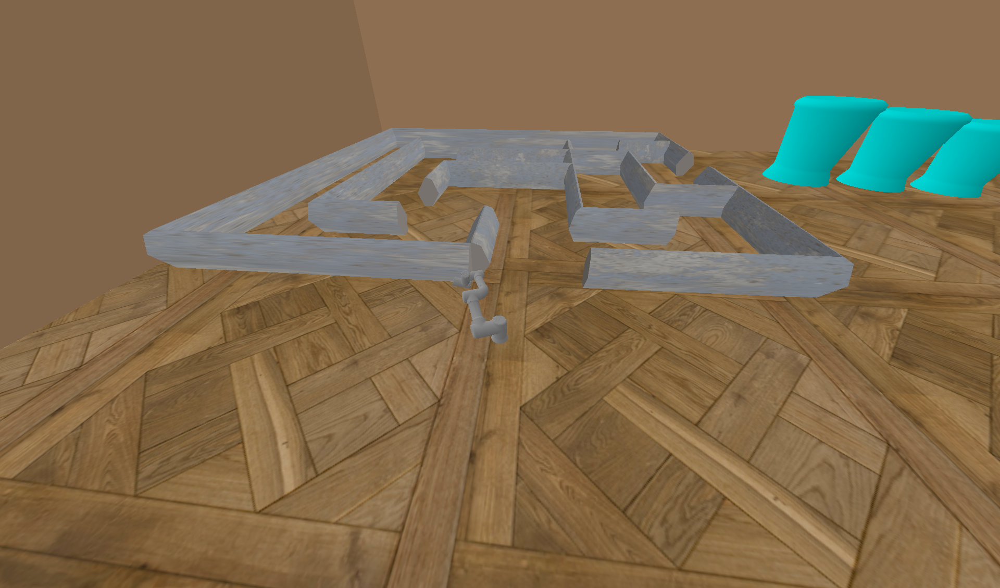
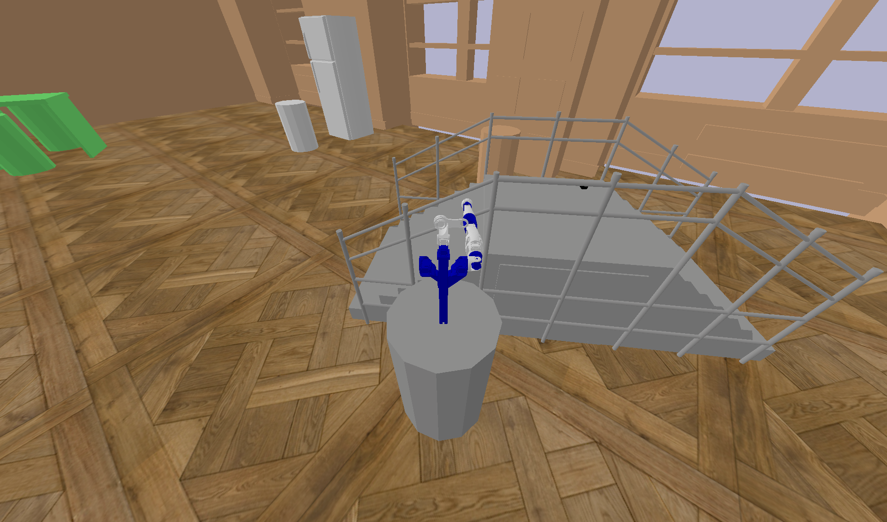
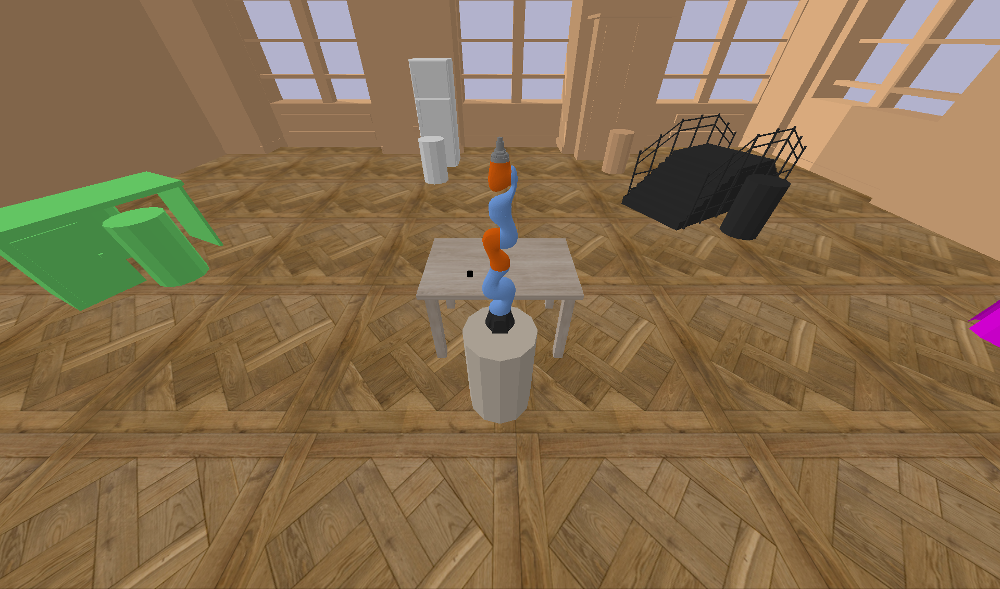
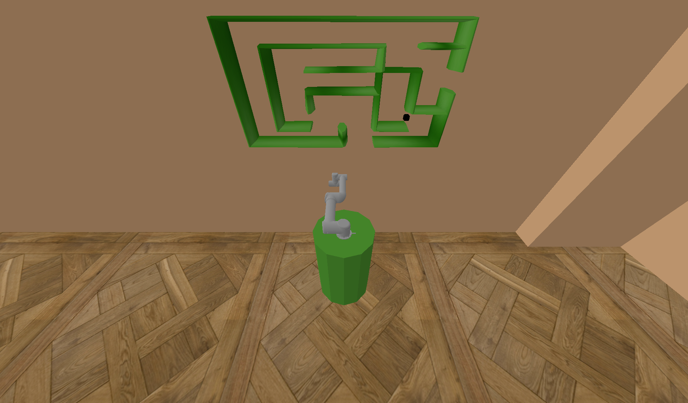

.. _workspace:

Workspaces
==========

The environment setup is adjusted based on selected workspace. The origin of coordinate frame is always 
placed at the center of the top face of the robot's stand, the positive x-axis points right from the robot, 
the positive y-axis points to the front from the robot. At each workspace, 5 cameras are initialized, 
watching the scene from the back, front, left, right and top.

+----------------+---------------+----------------+----------------+
| Name           | Type          | Suitable tasks | Parameter      |
|                |               |                | value          |
+================+===============+================+================+
| Tabledesk      | manipulation  | Reach, Push,   | table          |
|                |               | Pick, Place,   |                |
|                |               | PicknPlace     |                |
+----------------+---------------+----------------+----------------+
| Drawer         | manipulation  | Reach, Pick,   | drawer         |
|                |               | PicknPlace     |                |
+----------------+---------------+----------------+----------------+
| Fridge         | manipulation  | Reach,Push,    | fridge         |
|                |               | Open, Close,   |                |
|                |               | Pick           |                |
+----------------+---------------+----------------+----------------+
| Baskets        | manipulation  | Throw, Hit     | baskets        |
+----------------+---------------+----------------+----------------+
| Darts          | manipulation  | Throw, Hit     | darts          |
+----------------+---------------+----------------+----------------+
| Football       | manipulation  | Throw, Hit     | football       |
+----------------+---------------+----------------+----------------+
| Collaborative  | collaboration | Give, Hold,    | collabtable    |
| table          |               | Move together  |                |
+----------------+---------------+----------------+----------------+
| Vertical maze  | planning      | –              | veticalmaze    |
+----------------+---------------+----------------+----------------+
| Maze           | navigation    | –              | maze           |
+----------------+---------------+----------------+----------------+
| Stairs         | navigation    | –              | stairs         |
+----------------+---------------+----------------+----------------+

Baskets
-------

.. image:: yumi_baskets.png
  :width: 700
  :alt: Yumi baskets

Collabtable
-----------

Darts
-----

Football
--------

Fridge
------

.. image:: gummi_fridge.png
  :width: 700
  :alt: Gummi fridge

Maze
----

Stairs
------

Table
-----

Verticalmaze
------------

