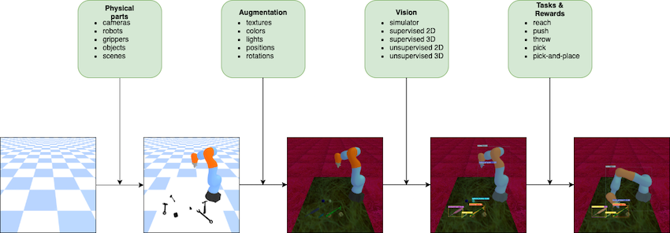

.. mygym documentation master file, created by
   sphinx-quickstart on Fri Nov 13 15:32:27 2020.
   You can adapt this file completely to your liking, but it should at least
   contain the root `toctree` directive.

Welcome to myGym's documentation!
=================================

We introduce myGym, a toolkit suitable for fast prototyping of neural
networks in the area of robotic manipulation and navigation. Our toolbox
is fully modular, so you can train your network to control different
robots in several envinronments defined parametrically. You can also
create curicullum of tasks and test your network set of tasks with
inreasing complexity. There is automatic evaluation and benchmark tool
for your network. We pretrained the neural networks for visual
recognition of all objects in the simulator. We constantly train
networks to provide baselines for the tasks in the toolbox. The training
is 50x faster with the visualization turned on than realtime
simulations.

.. note::
   Mygym is now under construction

Overview
--------

+-----------------------------------+------------------------------------+
| Environment                       | Gym-v0 is suitable for             |
|                                   | manipulation, navigation and       |
|                                   | planning tasks                     |
+===================================+====================================+
| Workspaces                        | Tabledesk, Collaborative table,    |
|                                   | Maze, Vertical maze, Drawer, Darts,|
|                                   | Football, Fridge, Stairs, Baskets  |
+-----------------------------------+------------------------------------+
| Vision                            | Cartesians, RGB, Depth, Class,     |
|                                   | Centroid, Bounding Box, Semantic   |
|                                   | Mask, Latent vector                |
+-----------------------------------+------------------------------------+
| Robots                            | 7 robotic arms, 2 dualarms,        |
|                                   | humanoid                           |
+-----------------------------------+------------------------------------+
| Robot actions                     | Absolute, Relative, Joints         |
+-----------------------------------+------------------------------------+
| Objects                           | 54 objects in 5 categories         |
+-----------------------------------+------------------------------------+
| Tasks                             | Reach, Push, Pick, Place,          |
|                                   | PicknPlace, Throw, Hit, Catch,     |
|                                   | Navigate                           |
+-----------------------------------+------------------------------------+
| Randomizers                       | Light, Texture, Size, Camera       |
|                                   | position                           |
+-----------------------------------+------------------------------------+
| Baselines                         | Tensorflow, Pytorch                |
+-----------------------------------+------------------------------------+

Modular Structure
-----------------

We developed fully modular toolbox where user can easily combine the
predefined elements into custom envinronment. There are specific modules
for each component of the simulation. User can easily modify and add
custom modules.

.. toctree::
   :maxdepth: 1
   :caption: How to

   user_guide/installation
   user_guide/visualization
   user_guide/basic_training
   user_guide/tutorial_parametric
   user_guide/tutorial_config
   user_guide/train_camera
   user_guide/train_vae
   user_guide/parallel_training
   user_guide/train_switch
   user_guide/tensorboard
   user_guide/test_model

.. toctree::
   :maxdepth: 1
   :caption: How to - advanced

   user_guide/write_reward
   user_guide/create_workspace
   user_guide/create_network
   user_guide/dataset 
   
.. toctree::
   :maxdepth: 1
   :caption: Gym 

   environments/workspace
   environments/mygym_objects
   environments/mygym_robots
   environments/gym_env

.. toctree::
   :maxdepth: 1
   :caption: Baselines

   baselines/table

.. toctree::
   :maxdepth: 1
   :caption: Important classes

   core_modules/base_env
   core_modules/robot
   core_modules/task
   core_modules/reward
   core_modules/vision
   other/camera
   other/env_object

Citing myGym
------------

.. code-block:: bibtex

    @misc{myGym,
      author = {},
      title = {myGym},
      year = {2020},
      publisher = {GitHub},
      journal = {GitHub repository},
      howpublished = {},
    }

Authors
-------

Core team:

`Michal Vavrecka <https://kognice.wixsite.com/vavrecka>`_, 
`Gabriela Sejnova <https://kognice.wixsite.com/vavrecka>`_, 
`Megi Mejdrechova <https://www.linkedin.com/in/megi-mejdrechova>`_, 
`Nikita Sokovnin <https://kognice.wixsite.com/vavrecka>`_

Contributors:

Radoslav Skoviera, Peter Basar, Vojtech Pospisil, Jiri Kulisek, Anastasia Ostapenko, Sara Thu Nguyen

Paper
-----

`myGym: Modular Toolkit for Visuomotor Robotic Tasks <https://arxiv.org/abs/2012.11643>`_

Indices and tables
==================

* :ref:`genindex`
* :ref:`modindex`
* :ref:`search`
