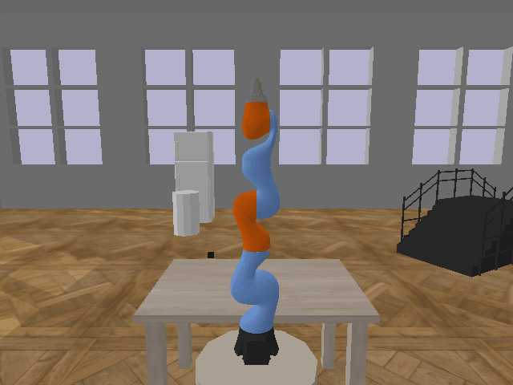

.. _basic_training:

Train a robot
=============

Run the default training without specifying parameters:

``python train.py``

The training will start with gui window and standstill visualization. New directory 
is created in the logdir, where tranining checkpoints, final model and other relevant 
data are stored. 

Wait until the first evaluation after 10000 steps to check the progress:

After 50000 steps the arm starts to move towards the goal object:

After 100000 steps the arm is able to reach the goal object with 80%
accuracy:

