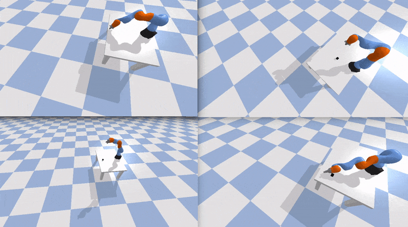

.. _parallel_training:

Train in parallel
=================

We developed scripts for parallel training to speed up the training process. You
can edit the desired parameters in train_parallel.py and run it:

``python train_parallel.py``

The default config will train 4 parallel simulation with different RL in
the same conditions. After several training steps you can see the
difference in performace among algorhitms. For better performance the
backround visualization is turned off:

