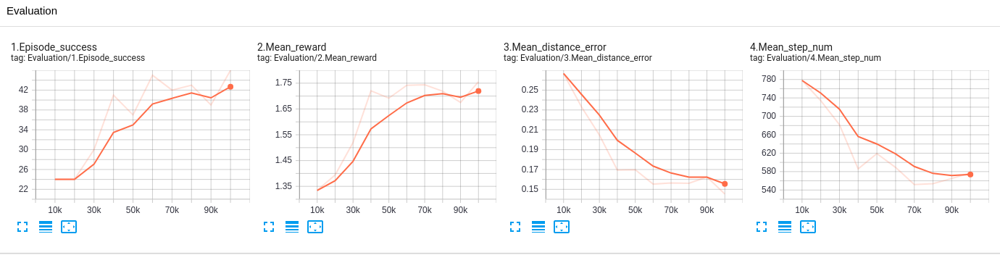

.. _tensorboard:

Evaluate with tensorboard
=========================

There is automatic evaluation and logging in the train script. It is
controlled by parameters –eval_freq and –eval_episodes. The log files
are stored in the folder with trained model and you can easily visualize
learning progress after the training and compare training parameters.
There are also gifs for each eval period stored to compare robot
performance during training. We also implemented evaluation in
tensorboard:

``tensorboard --logdir ./trained_models/yourmodel``

