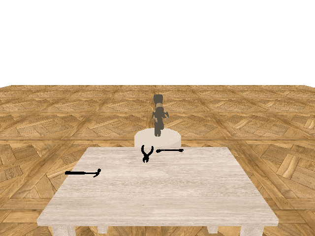

.. _tutorial_config:

Edit config file
================

As the parametric definition is problematic in more complex projects, we
present config files that will help with the reproducibility of the
results. In this tutorial, we present the basics you should know in order to
configure the training parameters to fit your needs.

The example of basic config file is
`here <https://github.com/incognite-lab/myGym/blob/master/myGym/configs/train_example.json>`_. Yo can clone and edit this
file according to your needs and run the training just by typing:

``python train.py --config ./configs/train_example.json``

Config file
-----------

The most convinient way to control the training parameters is using a
*config file*. This file is organized into several sections, which we
will cover step by step. Alternatively, it is also possible to pass
config arguments to the main script directly using command line
arguments. See the complete list of parameters here :ref:`tutorial_parametric`.

1. .. rubric:: Environment
      :name: environment

   Specify the name of a gym environment, where the training will take
   place. We recommend you to choose the one we prepared, :ref:`gym_env`. 
   This environment contains several :ref:`workspace` suitable for tasks of 
   different type and difficulty and you can easily choose the right one using 
   workspace parameter. In case you wish to build your own environment,
   we advise you to create it as a child class of the Workspace.

Since myGym is modular, all environments share a common base, where lots
od helpful methods are defined. Mainly it is management of cameras,
rendering and visualization. Thanks to that, you can choose which camera
in the scene will be active and how it will render images, easily in the
*config file*.

We also prepared some visualization functions, which you may find useful
for watching training progress, especially if you use vision data in
your env. The 3D render of the scene during evaluation episodes in GUI window
may be enabled as well.

Lastly, there is an option to show only minimal version of Gym
environment and render only the one selected workspace, that is controlled
by visgym parameter.

*In this example, Gym-v0 build on pybullet is chosen. The
openGL renderer is used to render and visualize images from camera
number 0. The GUI is disabled and only minimal version of Workspace
will be rendered.*

::

   #Environment
   "env_name":"Gym-v0",
   "workspace":"table",
   "engine":"pybullet",
   "render":"opengl",
   "camera":0,
   "gui":0,
   "visualize":1,
   "visgym":0,

2. .. rubric:: Robot
      :name: robot

   To make things easier, we prepared models of several robots commonly
   used in industry or research area :ref:`mygym_robots`.
   Each of them can be placed in the training environment simply by
   specifying its name in the *config file* and its end-effectors
   initial position. In case you would like to add your own model of a
   robot, refere to :ref:`robot` for implementation details.

In myGym, it is possible to choose from three mechanisms of robot
control. The instructions robot gets can be absolute position of its
end-effector expressed in the world frame of the environment.
Alternatively, the required position can be given relatively to the
current position in form of incremental steps to be taken in xyz
directions.

In both described cases the engine makes use of the robot model and
implementation of inverse kinematics solver to calculate corresponding
motors commands. Last option is to control the robot through the motors
commands directly.

*In this example, robot Jaco is placed in the environment with
end-effector initialized at xyz coordinates [0.0, 0.5, 0.5]. During
training, it will receive instructions in form of direct motors
commands.*

::

   #Robot
   "robot":"jaco",
   "robot_action":"joints",
   "robot_init":[0.0, 0.5, 0.5],

3. .. rubric:: Task
      :name: task

   In this section, you design the task the robot will be learning. Its
   type and specified task objects, that are involved in performing the
   task, define how robot’s observation will look like and how reward
   will be calculated.

Optionally, you can add more objects to the scene, to make the scene
more complex. At the beginning of each episode, objects specified
in this section will be randomly placed somewhere within the specified
sampling area. The sampling area parameter is optional.

You can refere to the list of predefined tasks :ref:`task` and list of available objects :ref:`mygym_objects` to choose
from.

*In this example, robot will be trained to learn to reach a hammer, that
can be located among some other tools in a volume in space reaching from
-0.7 to 0.7, 0.5 to 1.3 and 0.1 to 0.1 in x, y and z direction
respectively.*

::

   #Task
   "task_type":"reach",
   "task_objects":["hammer"],
   "used_objects":["screwdriver", "wrench", "pliers"],
   "object_sampling_area":[-0.7, 0.7, 0.5, 1.3, 0.1, 0.1],

4. .. rubric:: Reward
      :name: reward

   The reward characteristics together with task configuration determine
   how robot’s observation will be defined and the reward signal
   calculation.

MyGym is focused on robotic manipulation and navigation tasks, therefore
the key information for completing the task is the position of the
robot, of its gripper and of the relevant objects in the scene. MyGym
offers three ways of obtaining these information, which differ in the
level of supervision, and impact the difficultness of learned task. For
more details, refere to the :ref:`reward_class`.

*In this example, 3D position of robot’s gripper and task objects will
be determined from camera rendered RGB and depth images using pretrained
vision model based on YOLACT neural network. Path to the vision model and 
corresponding config object is given. The reward signal at each
step will be equal the difference between increased or descreased
euclidean distance between robot’s gripper and reached object compared
to the previous step.*

::

   #Reward
   "reward_type":"3dvs",
   "reward":"distance",
   "distance_type":"euclidean",
   "vae_path":null,
   "yolact_path":"trained_models/weights_yolact_mygym_23/crow_base_15_266666.pth",
   "yolact_config":"trained_models/weights_yolact_mygym_23/config_train_15.obj",

5. .. rubric:: Train
      :name: train

   In myGym, we implemented stable baselines, which help you to start
   training quickly with ease.

In the Train section of *config file*, you only need to choose the
framework, training algorithm and number of steps after which the model
will be updated. Here you can also put constraints on the maximal length
of an episode and total amount of training steps.

*In this example, the training using tensorflow framework is enabled.
The stable baselines implementation of PPO2 algorithm is chosen with
update after 1024 steps. The training will take 500 000 steps in the gym
environment and each training episode will last maximum 1024 steps.*

::

   #Train
   "train_framework":"tensorflow",
   "algo":"ppo2",
   "max_episode_steps":1024,
   "algo_steps":1024,
   "steps":500000,
   "pretrained_model":null,
   "multiprocessing":false,

6. .. rubric:: Evaluation
      :name: evaluation

   Evaluation section allows you to watch and log the training progress
   into a file for a later use. You can set to run several evaluation
   episodes always after specified amount of steps and/or at the very
   end of the training.

The evaluation takes place in a copy of your gym environment and uses
the learned model at the given stage of training. You can watch its
performance, if you have turned GUI on.

*In this example, 100 evaluation episodes are carried out after each
50000 training steps.*

::

   #Evaluation
   "eval_freq":50000,
   "eval_episodes":100,

7. .. rubric:: Saving and logging
      :name: saving-and-logging

   You specify the directory, where the trained model and possibly other
   data are being stored during training, in the final section of
   *config file*. In this directory you also find a copy of the *config file*,
   which you may later use for testing of your trained model.
   
   If you enable record option, a gif of robot’s
   performance during evaluation episodes will be recorded and stored
   there as well. 

*In this example, trained model will be saved in trained_models folder
without any recorded gifs.*

::

   #Saving and logging
   "logdir":"trained_models",
   "record":0

**The complete *config file* then looks like this:**

.. literalinclude:: ../../../myGym/configs/train_example.json
   :language: python