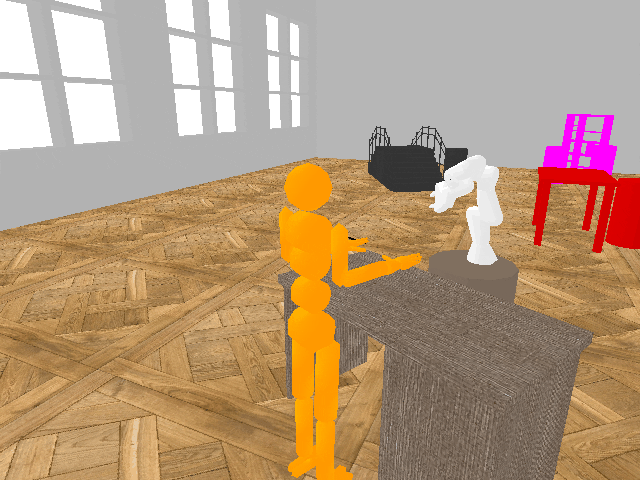

.. _tutorial_parametric:

Set parameters
==============

As the myGym is modular toolbox you can easily change your training setup.

Train a different :ref:`mygym_robots`:

``python train.py --robot panda``

Change the :ref:`workspace` within the gym:

``python train.py  --workspace collabtable``

Set a different :ref:`task_class`:

``python train.py  --task push``

Choose a task :ref:`mygym_objects`:

``python train.py --task_objects wrench``

It is possible to pass following parameters to the *train.py* and *test.py* scripts 
directly using command line arguments. Alternatively, you can use a *config file*, see :ref:`tutorial_config`.

