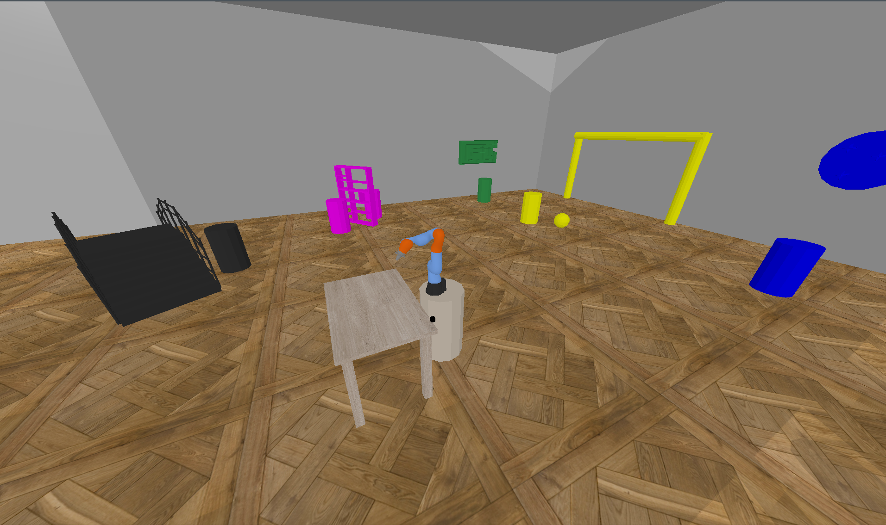
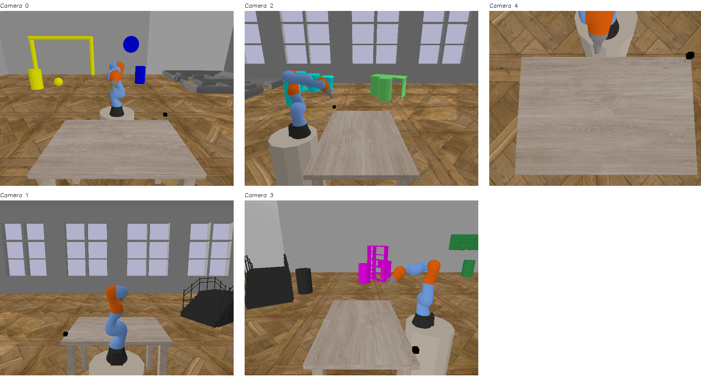
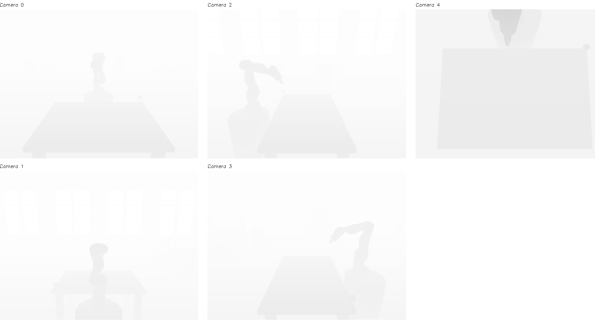

.. _visualization:

Visualize workspace
===================

You can visualize the virtual gym prior to the training.

``python test.py``

There will be the default worskpace activated. The commands to the robot
joints are random.

There are also visual outputs from the active cameras (both RGB and
Depth):

